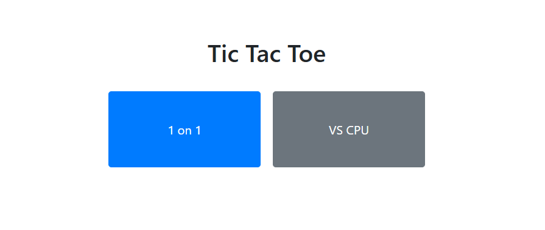
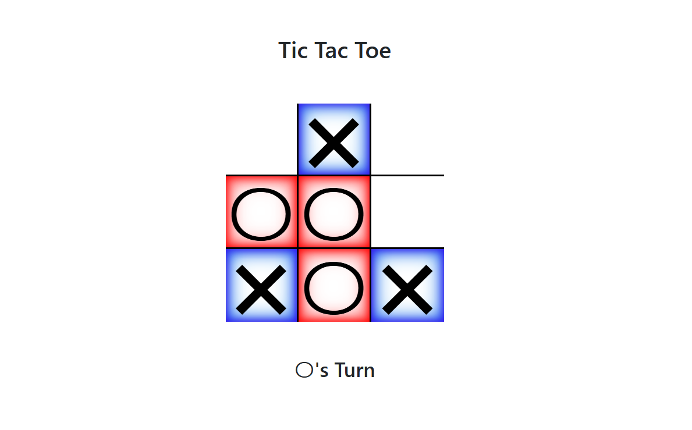
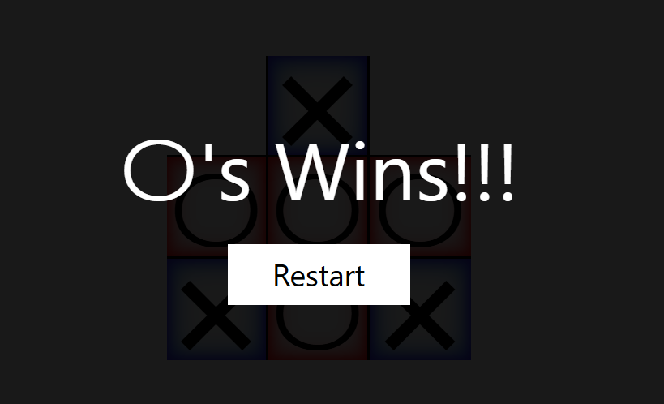

# Tic Tac Toe
## プロジェクト概要
三目並べゲーム（〇✖ゲーム）です。
1対1対戦(人対人対戦)とCPU対戦の2つのゲームモードで遊べます。
## 遊び方
1. 最初の画面で1 vs 1か、VS CPUのボタンを押してゲームモードを選んでください。
    1. 1 vs 1を選んだ場合、〇が先攻で2人プレイができます
    2. VS CPUを選んだ場合は、CPUとの対戦ができます。この場合、ユーザーが先攻です。また、ユーザーの手は〇です。
2. モードを選んだら、自分のターンの際に空いているマスをクリックしてください。
3. 縦、横、斜めのいずれかを揃えられたほうがゲームの勝者になります。
4. 勝者が決まる、または引き分けになった際に結果が画面に表示されます。もう一度プレーする場合、Restartボタンを押してください。
## スクリーンショット

## 使用言語や技術
- HTML
- CSS
- Bootstrap
- JavaScript
## 開発メンバー
- [HikaruCS](https://github.com/HikaruCS) (リーダー)
- [souma1024](https://github.com/souma1024)
- [Kai7orz](https://github.com/Kai7orz)